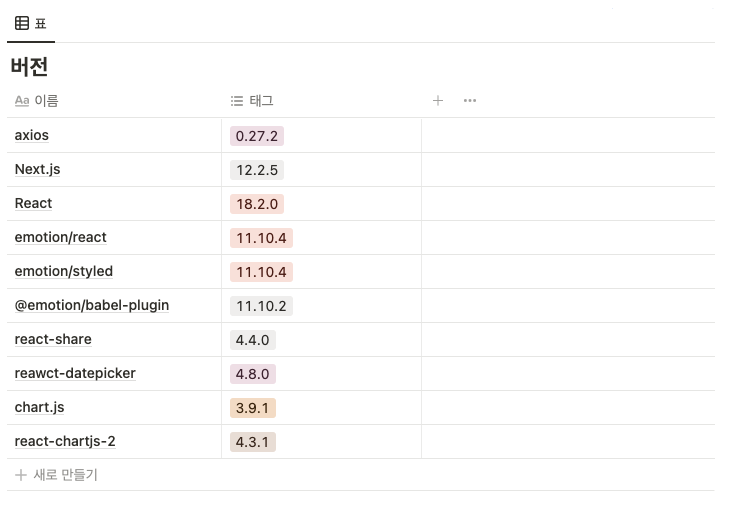

# 포팅 메뉴얼

- 프레임워크 및 라이브러리 버전
  - Frontend
  - Backend
  - DevOps
- Java 설치
- Nginx 설치 및 Https 환경 구축
  - Certbot 설치
  - Nginx 설정
- Kafka 환경 구축
  - Kafka 브로커, 커넥터 구축
  - Kafka 토픽 생성
  - Kafka 커넥터 생성
- ElasticSearch 서버 구축
  - ElasticSearch 설치
  - ElasticSearch 설정
  - ElasticSearch 실행
  - ElasticSearch 인덱스 생성
- YUTI FE&BE 서버 구축
  - Frontend env 설정
  - Backend application.yml 설정
- 외부 서비스 정리
  - Kakao
  - Youtube
- 시연시나리오

## 📜 프레임워크 및 라이브러리 버전

### Frontend



### Backend


### DevOps


## ☕️ Java 설치

```bash
$ sudo apt update
$ sudo apt install openjdk-8-jdk
```

### Java 버전 확인

```bash
$ java -version
```

## 🔒 Nginx 설치 및 Https 환경 구축

### 1) 패키지 목록 업데이트

```bash
sudo apt update
```

### 2) Nginx 설치

```bash
sudo apt install nginx
```

### 3) Nginx 설치가 완료됐다면 Nginx 실행

```bash
sudo nginx
```

### 4) Nginx를 설치했다면 해당 서버의 ip 또는 도메인의 80포트로 접속


### CertBot 설치 🤖

### 1) CertBot 설치

```bash
sudo apt-get install python3-certbot-nginx
```

### 2) CertBot을 실행하여 SSL 설치

```bash
sudo certbot --nginx -d <본인의 서버 주소>
```

위 명령어를 입력하고 나면 이메일 등록과 약관에 대한 질문이 나타납니다.

```
Please choose whether or not to redirect HTTP traffic to HTTPS, removing HTTP access.
- - - - - - - - - - - - - - - - - - - - - - - - - - - - - - - - - - - - - - - -
1: No redirect - Make no further changes to the webserver configuration.
2: Redirect - Make all requests redirect to secure HTTPS access. Choose this for
new sites, or if you're confident your site works on HTTPS. You can undo this
change by editing your web server's configuration.
- - - - - - - - - - - - - - - - - - - - - - - - - - - - - - - - - - - - - - - -
Select the appropriate number [1-2] then [enter] (press 'c' to cancel)

```

- 1번을 선택한다면 HTTP 트래픽을 HTTPS로 redirect하지 않습니다.
- 2번을 선택한다면 모든 Request들을 HTTPS로 redirect합니다.

원하시는 방식으로 설정하시면 HTTPS 환경이 구축됩니다.

### Nginx 설정

- />etc>nginx>conf.d>yuti.conf

```bash
server {

    root /var/www/html;
    error_page 502 /502.html;
    index index.html index.htm index.nginx-debian.html;
    server_name j7a502.p.ssafy.io; # managed by Certbot

    location = /502.html {
      root '/home/ubuntu/';
      internal;
    }

		location / {
      proxy_pass http://j7a502.p.ssafy.io:3000;
      proxy_http_version 1.1;
      proxy_set_header   Host $host;
      proxy_set_header   X-Real-IP $remote_addr;
      proxy_set_header   X-Forwarded-For $proxy_add_x_forwarded_for;
      proxy_set_header   X-Forwarded-Host $server_name;
    }

		location /api {
      proxy_pass http://j7a502.p.ssafy.io:8080;
      proxy_http_version 1.1;
      proxy_set_header   Host $host;
      proxy_set_header   X-Real-IP $remote_addr;
      proxy_set_header   X-Forwarded-For $proxy_add_x_forwarded_for;
      proxy_set_header   X-Forwarded-Host $server_name;

    }

    location /log {
      proxy_pass http://j7a502.p.ssafy.io:8888;
      proxy_http_version 1.1;
      proxy_set_header   Host $host;
      proxy_set_header   X-Real-IP $remote_addr;
      proxy_set_header   X-Forwarded-For $proxy_add_x_forwarded_for;
      proxy_set_header   X-Forwarded-Host $server_name;

    }
		location /login {
      proxy_pass http://j7a502.p.ssafy.io:3000;
      proxy_http_version 1.1;
      proxy_set_header   Host $host;
      proxy_set_header   X-Real-IP $remote_addr;
      proxy_set_header   X-Forwarded-For $proxy_add_x_forwarded_for;
      proxy_set_header   X-Forwarded-Host $server_name;

    }
		location /analytics {
      proxy_pass http://j7a502.p.ssafy.io:9090;
      proxy_http_version 1.1;
      proxy_set_header   Host $host;
      proxy_set_header   X-Real-IP $remote_addr;
      proxy_set_header   X-Forwarded-For $proxy_add_x_forwarded_for;
      proxy_set_header   X-Forwarded-Host $server_name;

    }

    listen [::]:443 ssl ipv6only=on; # managed by Certbot
    listen 443 ssl; # managed by Certbot
    ssl_certificate /etc/letsencrypt/live/j7a502.p.ssafy.io/fullchain.pem; # managed by Certbot
    ssl_certificate_key /etc/letsencrypt/live/j7a502.p.ssafy.io/privkey.pem; # managed by Certbot
    include /etc/letsencrypt/options-ssl-nginx.conf; # managed by Certbot
    ssl_dhparam /etc/letsencrypt/ssl-dhparams.pem; # managed by Certbot

}
```

## 🍇 Kafka 환경 구축

### Kafka 브로커, 커넥터 구축

`[set-up-kafka.sh](http://set-up-kafka.sh)` 의 export 변수들에 원하는 디렉토리를 설정합니다.

- export 변수
  - ZOOKEEPER_DATA_DIR : Zookeeper 데이터를 저장하는 디렉토리
  - ZOOKEEPER_DATALOG_DIR : Zookeeper 데이터 로그를 저장하는 디렉토리
  - KAFKA1_DATA_DIR : 1번 Kafka 브로커의 데이터를 저장하는 디렉토리
  - KAFKA2_DATA_DIR : 2번 Kafka 브로커의 데이터를 저장하는 디렉토리
  - KAFKA3_DATA_DIR : 3번 Kafka 브로커의 데이터를 저장하는 디렉토리

```bash
echo "========== [Kafka] Zookeeper and kafka broker setting... =========="
cd devops/kafka
docker network create --gateway 172.18.0.1 --subnet 172.18.0.0/16 broker

export ZOOKEEPER_DATA_DIR=/home/broker/zookeeper-kafka-data/zoo1/data
export ZOOKEEPER_DATALOG_DIR=/home/broker/zookeeper-kafka-data/zoo1/datalog
export KAFKA1_DATA_DIR=/home/broker/zookeeper-kafka-data/kafka1/data
export KAFKA2_DATA_DIR=/home/broker/zookeeper-kafka-data/kafka2/data
export KAFKA3_DATA_DIR=/home/broker/zookeeper-kafka-data/kafka3/data

docker-compose -f docker-compose-kafka.yml up --build -d

echo "========== [Kafka] Kafka connector setting... =========="
cd kafka-connector
docker-compose -f docker-compose-kafka-connector.yml up --build -d
```

`sh [set-up-kafka.sh](http://set-up-kafka.sh)` 명령어를 입력하여 Kafka 환경을 구축합니다.

### Kafka 토픽 생성

- Kafka 다운로드

```bash
$ wget https://archive.apache.rog/dist/kafka/2.5.0/kafka_2.12-2.5.0.tgz
$ tar xvf kafka_2.12-2.5.0.tgz
$ ll
$ cd kafka_2.12-2.5.0
```

- 토픽 생성

```bash
$ bin/kafka-topics.sh --create --bootstrap-server {본인의 서버:9092},{본인의 서버:9093},{본인의 서버:9094} \
--replication-factor 2 --partitions 3 --topic mbti-result
$ bin/kafka-topics.sh --create --bootstrap-server {본인의 서버:9092},{본인의 서버:9093},{본인의 서버:9094} \
--replication-factor 2 --partitions 3 --topic diff-time
$ bin/kafka-topics.sh --create --bootstrap-server {본인의 서버:9092},{본인의 서버:9093},{본인의 서버:9094} \
--replication-factor 2 --partitions 3 --topic share-button
$ bin/kafka-topics.sh --create --bootstrap-server {본인의 서버:9092},{본인의 서버:9093},{본인의 서버:9094} \
--replication-factor 2 --partitions 3 --topic share-result
$ bin/kafka-topics.sh --create --bootstrap-server {본인의 서버:9092},{본인의 서버:9093},{본인의 서버:9094} \
--replication-factor 2 --partitions 3 --topic leave-result
$ bin/kafka-topics.sh --create --bootstrap-server {본인의 서버:9092},{본인의 서버:9093},{본인의 서버:9094} \
--replication-factor 2 --partitions 3 --topic youtuber-analyzer
```

### Kafka 커넥터 생성

- 6개의 토픽(mbti-result, diff-time, share-button, share-result, leave-result, youtuber-analyzer)에 연결한 Kafka 커넥터를 생성합니다.
- 하나의 토픽에 하나의 커넥터를 생성하여 총 6개의 커넥터를 생성해야 합니다.

```bash
curl -L -X POST '{Kafka connect docker를 실행한 서버}:8083/connectors' \
-H 'Content-Type: application/json' \
--data-raw '{
    "name": {Kafka connector 이름},
    "config": {
        "connector.class": "io.confluent.connect.elasticsearch.ElasticsearchSinkConnector",
        "connection.url": {ElasticSearch 서버 주소},
        "connection.username":{ElasticSearch의 username},
        "connection.password":{ElasticSearch의 password},
        "tasks.max":"1",
        "topics":{Kafka 토픽},
        "topic.index.map":{Elastic 인덱스},
        "key.ignore":"true",
        "schema.ignore":"true",
        "key.converter": "org.apache.kafka.connect.json.JsonConverter",
        "key.converter.schemas.enable": "false",
        "value.converter": "org.apache.kafka.connect.json.JsonConverter",
        "value.converter.schemas.enable": "false"
    }
}'
```

## 🔎 ElasticSearch 서버 구축

### ElasticSearch 설치

```bash
wget https://artifacts.elastic.co/downloads/elasticsearch/elasticsearch-7.9.1-linux-x86_64.tar.gz
wget https://artifacts.elastic.co/downloads/elasticsearch/elasticsearch-7.9.1-linux-x86_64.tar.gz.sha512
shasum -a 512 -c elasticsearch-7.9.1-linux-x86_64.tar.gz.sha512
tar -xzf elasticsearch-7.9.1-linux-x86_64.tar.gz
```

### ElasticSearch 설정

```bash
cd elasticsearch-7.9.1/

echo "cluster.name: {클러스터명}}" >> config/elasticsearch.yml
echo "node.name: {ElasticSearch 노드명}" >> config/elasticsearch.yml
echo "network.host: {접근 가능한 IP}" >> config/elasticsearch.yml
echo "http.port: {Elasticsearch 접속 포트}" >> config/elasticsearch.yml
echo "transport.tcp.port: {클라이언트 접속 포트}" >> config/elasticsearch.yml
echo "discovery.seed_hosts: ["0.0.0.0"]" >> config/elasticsearch.yml
echo "cluster.initial_master_nodes: [“{마스터노드명}“]" >> config/elasticsearch.yml
echo "xpack.security.transport.ssl.enabled: true" >> config/elasticsearch.yml
echo "xpack.security.enabled: true" >> config/elasticsearch.yml

sudo bin/elasticsearch-setup-passwords interactive  #명령어 입력 후 패스워드 연속으로 입력

# 한글 자소 분석기 설치
bin/elasticsearch-plugin install https://github.com/sdg9670/elasticsearch-jaso-analyzer/releases/download/7.9.1/jaso-analyzer-plugin-7.9.1-plugin.zip
```

### ElasticSearch 실행

```bash
./bin/elasticsearch -d
```

### ElasticSearch 인덱스 생성

- mbti-result, diff-time, share-result, youtuber-analyzer-v3, share-button, leave-result 6개의 인덱스 생성 필요

```bash
curl -XPUT -H 'Content-Type: application/json' j7a502.p.ssafy.io:9200/mbti-result/ -d '{
  "settings": {
    "index" : {
        "creation_date" : "1664438287351",
        "number_of_shards" : "1",
        "number_of_replicas" : "1",
        "uuid" : "WIGAiRmXQ2-7nAZHzQXl5A",
        "version" : {
          "created" : "7090199"
        },
        "provided_name" : "mbti-result"
    }
  },
	"mappings": {
    "properties" : {
        "mbti" : {
          "type" : "keyword"
        },
        "timestamp" : {
          "type" : "date"
        },
        "userAgent" : {
          "type" : "text",
          "fields" : {
            "keyword" : {
              "type" : "keyword",
              "ignore_above" : 256
            }
          }
        },
        "userIpAddress" : {
          "type" : "text",
          "fields" : {
            "keyword" : {
              "type" : "keyword",
              "ignore_above" : 256
            }
          }
        },
        "youtuber" : {
          "type" : "text",
          "fields" : {
            "keyword" : {
              "type" : "keyword",
              "ignore_above" : 256
            }
          }
        }
      }
  }
}'
```

```bash
curl -XPUT -H 'Content-Type: application/json' j7a502.p.ssafy.io:9200/diff-time/ -d '{
  "settings": {
    "index" : {
        "number_of_shards" : "1",
        "provided_name" : "diff-time",
        "max_result_window" : "2147483647",
        "creation_date" : "1664356894315",
        "number_of_replicas" : "1",
        "uuid" : "MMQidduMQamW-Z7xXZ1Hzw",
        "version" : {
          "created" : "7090199"
        }
      }
  },
	"mappings" : {
		"properties" : {
        "answer" : {
          "type" : "text",
          "fields" : {
            "keyword" : {
              "type" : "keyword",
              "ignore_above" : 256
            }
          }
        },
        "color" : {
          "type" : "text",
          "fields" : {
            "keyword" : {
              "type" : "keyword",
              "ignore_above" : 256
            }
          }
        },
        "diffTime" : {
          "type" : "date"
        },
        "pageNo" : {
          "type" : "long"
        },
        "timestamp" : {
          "type" : "date"
        },
        "userAgent" : {
          "type" : "text",
          "fields" : {
            "keyword" : {
              "type" : "keyword",
              "ignore_above" : 256
            }
          }
        },
        "userIpAddress" : {
          "type" : "text",
          "fields" : {
            "keyword" : {
              "type" : "keyword",
              "ignore_above" : 256
            }
          }
        }
      }
	}
}'
```

```bash
curl -XPUT -H 'Content-Type: application/json' j7a502.p.ssafy.io:9200/share-result/ -d '{
  "settings": {
    "index" : {
        "creation_date" : "1664438240077",
        "number_of_shards" : "1",
        "number_of_replicas" : "1",
        "uuid" : "UQW29B0iT_mK6SE3dCuj8A",
        "version" : {
          "created" : "7090199"
        },
        "provided_name" : "share-result"
      }
  },
	"mappings": {
		"properties" : {
        "shareResult" : {
          "type" : "keyword"
        },
        "timestamp" : {
          "type" : "date"
        },
        "userAgent" : {
          "type" : "text",
          "fields" : {
            "keyword" : {
              "type" : "keyword",
              "ignore_above" : 256
            }
          }
        },
        "userIpAddress" : {
          "type" : "text",
          "fields" : {
            "keyword" : {
              "type" : "keyword",
              "ignore_above" : 256
            }
          }
        }
      }
	}
}'
```

```bash
curl -XPUT -H 'Content-Type: application/json' j7a502.p.ssafy.io:9200/youtuber-analyzer-v3/ -d '{
  "settings": {
    "index" : {
        "number_of_shards" : "5",
        "provided_name" : "youtuber-analyzer-v3",
        "creation_date" : "1664903989352",
        "analysis" : {
          "filter" : {
            "suggest_filter" : {
              "type" : "edge_ngram",
              "min_gram" : "1",
              "max_gram" : "50"
            }
          },
          "analyzer" : {
            "suggest_search_analyzer" : {
              "type" : "custom",
              "tokenizer" : "jaso_search_tokenizer"
            },
            "suggest_index_analyzer" : {
              "filter" : [
                "suggest_filter"
              ],
              "type" : "custom",
              "tokenizer" : "jaso_index_tokenizer"
            }
          },
          "tokenizer" : {
            "jaso_index_tokenizer" : {
              "type" : "jaso_tokenizer",
              "chosung" : "true",
              "mistype" : "false"
            },
            "jaso_search_tokenizer" : {
              "type" : "jaso_tokenizer",
              "chosung" : "false",
              "mistype" : "true"
            }
          }
        },
        "number_of_replicas" : "1",
        "uuid" : "Oss2UEgXTfyPtES2uB7mUg",
        "version" : {
          "created" : "7090199"
        }
      }
  },
	"mappings": {
		"properties" : {
        "channel_id" : {
          "type" : "keyword"
        },
        "channel_name" : {
          "type" : "text",
          "store" : true,
          "analyzer" : "suggest_index_analyzer",
          "search_analyzer" : "suggest_search_analyzer"
        },
        "thumbnail" : {
          "type" : "keyword"
        },
        "topic" : {
          "type" : "nested",
          "properties" : {
            "topic_id" : {
              "type" : "keyword"
            },
            "topic_name" : {
              "type" : "keyword"
            }
          }
        }
      }
	}
}'

curl -XPOST -H 'Content-Type: application/json' "j7a502.p.ssafy.io:9200/_aliases" -d'
{
    "actions": [
        {
            "add" : {
                "index" : "youtuber-analyzer-v3",
                "alias" : "youtuber-analyzer"
            }
        }
    ]
}'
```

```bash
curl -XPUT -H 'Content-Type: application/json' j7a502.p.ssafy.io:9200/share-button/ -d '{
  "settings": {
    "index" : {
        "creation_date" : "1664652545803",
        "number_of_shards" : "1",
        "number_of_replicas" : "1",
        "uuid" : "7dFnq8WpS3yqOLdMdQ1qwQ",
        "version" : {
          "created" : "7090199"
        },
        "provided_name" : "share-button"
      }
  },
	"mappings" : {
      "properties" : {
        "sns" : {
          "type" : "keyword"
        },
        "timestamp" : {
          "type" : "date"
        },
        "userAgent" : {
          "type" : "text",
          "fields" : {
            "keyword" : {
              "type" : "keyword",
              "ignore_above" : 256
            }
          }
        },
        "userIpAddress" : {
          "type" : "text",
          "fields" : {
            "keyword" : {
              "type" : "keyword",
              "ignore_above" : 256
            }
          }
        }
      }
    }
}'
```

```bash
curl -XPUT -H 'Content-Type: application/json' j7a502.p.ssafy.io:9200/leave-result/ -d '{
  "settings": {
    "index" : {
        "creation_date" : "1664296922098",
        "number_of_shards" : "1",
        "number_of_replicas" : "1",
        "uuid" : "mx0vN8zSQmmGo9KCb4Sx5Q",
        "version" : {
          "created" : "7090199"
        },
        "provided_name" : "leave-result"
      }
  },
	"mappings" : {
      "properties" : {
        "pageNo" : {
          "type" : "long"
        },
        "timestamp" : {
          "type" : "date"
        },
        "userAgent" : {
          "type" : "text",
          "fields" : {
            "keyword" : {
              "type" : "keyword",
              "ignore_above" : 256
            }
          }
        },
        "userIpAddress" : {
          "type" : "text",
          "fields" : {
            "keyword" : {
              "type" : "keyword",
              "ignore_above" : 256
            }
          }
        }
      }
    }
}'
```

### ElasticSearch 인덱스 import

```bash
npm install elasticdump -g

elasticdump --input={dump 파일 위치} --output={elasticsearch username}:{elasticsearch password}@{elasticsearch 주소}
```

## 💻 YUTI FE&BE 서버 구축

### Frontend env 설정

- frontend>.env

```bash
NEXT_PUBLIC_KAKAO_API_KEY={Kakao API Key}
```

- frontend>.env.development

```bash
NEXT_PUBLIC_ENV_HOST = http://localhost/
NEXT_PUBLIC_ENV_PORT = 8888
NEXT_PUBLIC_SECOND_ENV_PORT = 8080
NEXT_PUBLIC_MANAGER_ENV_PORT = 9090
```

- frontend>.env.production

```bash
NEXT_PUBLIC_ENV_HOST = https://j7a502.p.ssafy.io
NEXT_PUBLIC_ENV_PORT = 443
NEXT_PUBLIC_SECOND_ENV_PORT = 443
NEXT_PUBLIC_MANAGER_ENV_PORT = 443
```

### Backend application.yml 설정

- backend>logging>src>main>resources>application.yml

```yaml
server:
  port: 8888

spring:
  kafka:
    bootstrap-servers: { Kafka 클러스터 서버 주소와 포트 }
    producer:
      acks: 1
      key-serializer: org.apache.kafka.common.serialization.StringSerializer
      value-serializer: org.apache.kafka.common.serialization.StringSerializer
```

- backend>main-server>src>main>resources>application.yml

```yaml
es:
  host: { ElasticSearch 서버 호스트 }
  id: { ElasticSearch Username }
  password: { ElasticSearch Password }
  search-index: { youtuber 데이터 인덱스 }
  result-index: { MBTI 설문결과 인덱스 }

youtube:
  keys: { Youtube API Key, ... }

spring:
  kafka:
    bootstrap-servers: { Kafka 클러스터 서버 주소와 포트 }
    producer:
      acks: 1
      key-serializer: org.apache.kafka.common.serialization.StringSerializer
      value-serializer: org.apache.kafka.common.serialization.StringSerializer
```

- backend>analytics>src>main>resources>application.yml

```yaml
spring:
  datasource:
    url: { 사용한 datasource url }
    username: { 사용한 datasource username }
    password: { 사용한 datasource password }
    driver-class-name: com.mysql.cj.jdbc.Driver
  jpa:
    hibernate:
      ddl-auto: none
    properties:
      hibernate:
        show_sql: true
        format_sql: true
logging.level:
  org.hibernate.SQL: debug

server:
  port: 9090

es:
  host: { ElasticSearch 서버 호스트 }
  id: { ElasticSearch Username }
  password: { ElasticSearch Password }
  kakao-index: { 카카오톡 공유 버튼 결과 인덱스 }
  survey-index: { 문항별 로그 인덱스 }
  share-index: { 결과 공유 로그 인덱스 }
  mbti-index: { MBTI 설문결과 인덱스 }
  youtuber-index: { youtuber 토픽 포함 데이터 인덱스 }
```

### 서버 빌드

`sh [start-docker.sh](http://start-docker.sh)` 명령어를 입력하여 Frontend, Backend 서버를 구축합니다.

## 🔗 외부 서비스 정리

### Kakao

1. Kakao Developers > 로그인 > 내 애플리케이션 > 애플리케이션 추가하기
   1. 애플리케이션 정보 추가해줍니다.
2. 앱 키 > JavaScript 키
   1. 앱 키 중에 JavaScript 키 이용합니다.
3. 내 애플리케이션 > 앱 설정 > 플랫폼 > Web 플랫폼 등록
   1. 로컬호스트 등 사용하는 도메인을 설정해줍니다.
4. 메시지 > 메시지 템플릿 > 메시지 템플릿 빌더 바로가기 혹은 도구 > 메시지 템플릿
   1. 템플릿 생성 후 코드에 적용합니다.

### Youtube

1. Google Cloud > 로그인 > 새 프로젝트
  1. 프로젝트 정보를 추가해줍니다.
2. OAuth 동의 화면 > User Type : 외부 > 애플리케이션 정보 입력
3. 라이브러리 > Youtube Data API v3 사용
4. 사용자 인증 정보 > API 키 발급

# 🖼 시연 시나리오

# 설문 페이지

## 설문 시작 페이지

- 테스트 시작하기에 현재까지 설문에 참여한 인원수가 나타납니다.
- 테스트 시작하기를 눌러 설문조사를 시작할 수 있습니다.


## 설문 진행 페이지

- 원하는 답변 버튼을 클릭하여 12가지 설문을 진행합니다.


## 유튜버 검색 페이지

- `구독하고 있는 유튜버를 검색해보세요`에 유튜버를 입력합니다.
- 입력하고 싶지 않다면 건너뛰기를 클릭하면 됩니다.


- 검색 결과에서 유튜버를 클릭하여 `내가 좋아하는 유튜브 채널`에 추가합니다.
- 선택이 끝난 후에 선택완료를 클릭합니다.


## 설문 결과 페이지

- 자신의 엠비티아이 결과와 유튜버 추천을 확인할 수 있습니다.
- 결과 페이지에서 환상의 혹은 환장의 케미 사진을 클릭하면 다른 MBTI 결과 페이지로 이동합니다.
- 카카오톡, 페이스북 등 SNS 혹은 URL로 공유 가능합니다.
- 결과페이지로 유입된 사용자는 `테스트 다시하기`를 통해 테스틀 시작할 수 있습니다.


## 카카오톡 공유하기

- 카카오톡으로 공유합니다.


# 통계 페이지

- `아이디: admin 비밀번호: yuti1234` 로 로그인을 합니다.


## 서비스 여정도

- 서비스 여정도를 클릭하여 이탈률을 확인할 수 있습니다.
- 메인 색깔 A/B 테스트를 진행하여 이탈률을 측정했습니다.


## 공유하기 클릭 빈도

- 공유하기 클릭 빈도를 클릭하여 확인할 수 있습니다.
- 카카오톡, 페이스북, 라인, 트위터, 기타 등 플랫폼 별 공유 빈도를 측정했습니다.


## 문항별 소요 시간

- 문항별 소요 시간을 클릭하여 확인할 수 있습니다.
- 설문 문항별 소요 시간을 측정했습니다.


## 카카오톡 유입 경로

- 카카오톡 유입 경로를 클릭하여 확인할 수 있습니다.
- 카카오톡으로 유입했을 경우 메인 페이지보다 메인 페이지로 많이 간 것을 알 수 있습니다.


## MBTI 선호도

- MBTI 선호도를 클릭하여 확인할 수 있습니다.
- MBTI별 선호하는 카테고리를 분석하였습니다.


